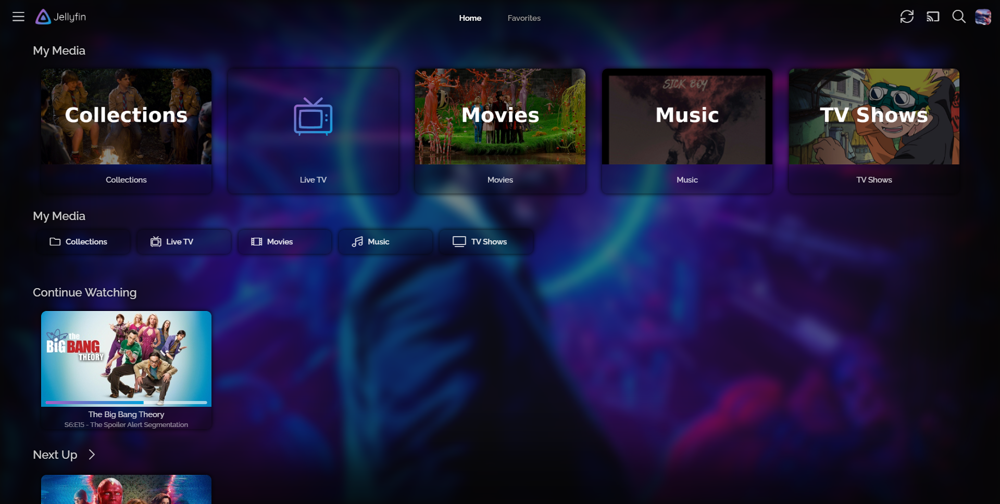
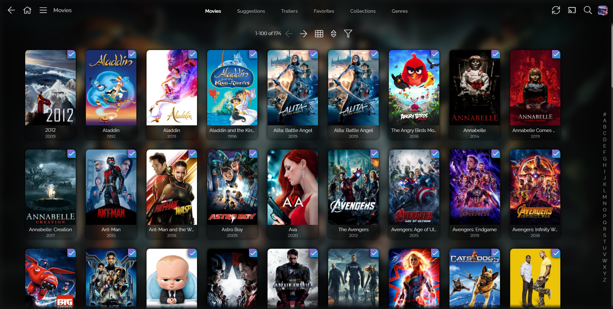
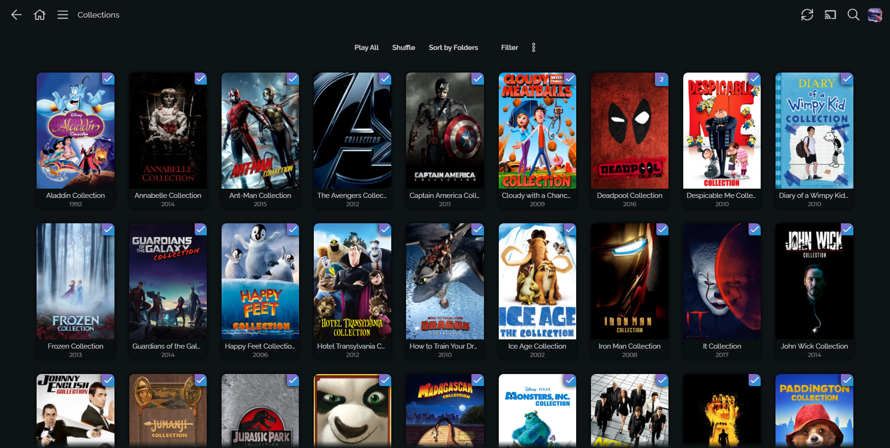
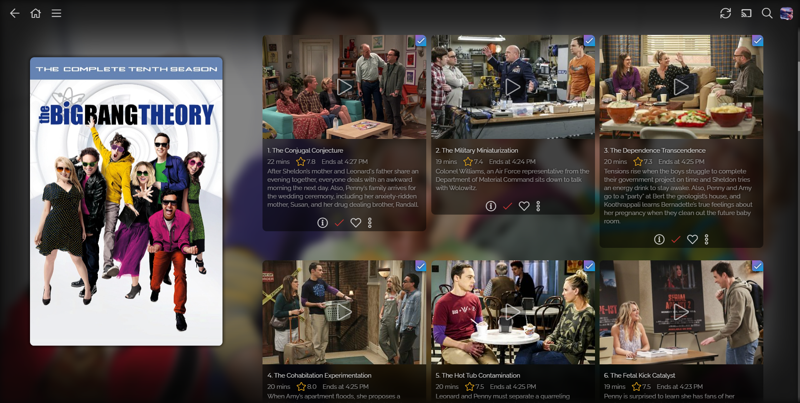
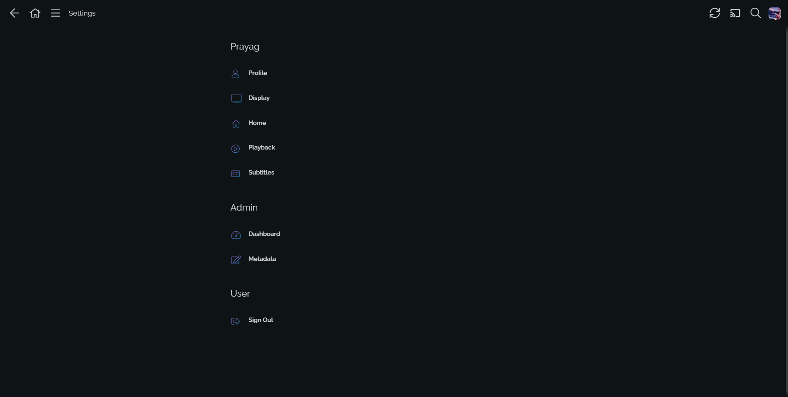
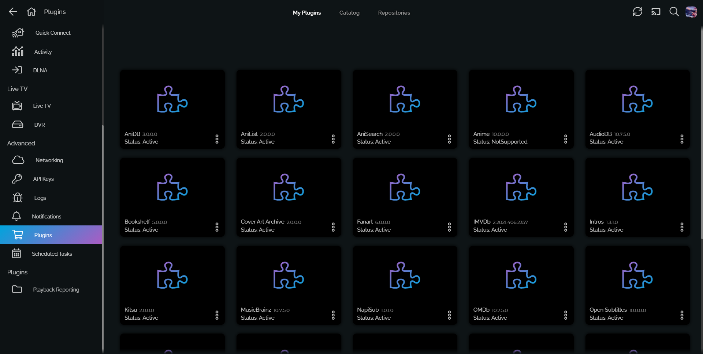
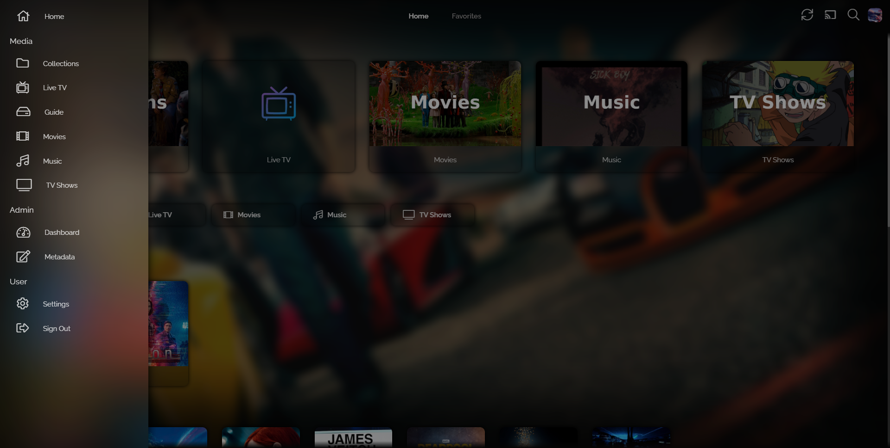
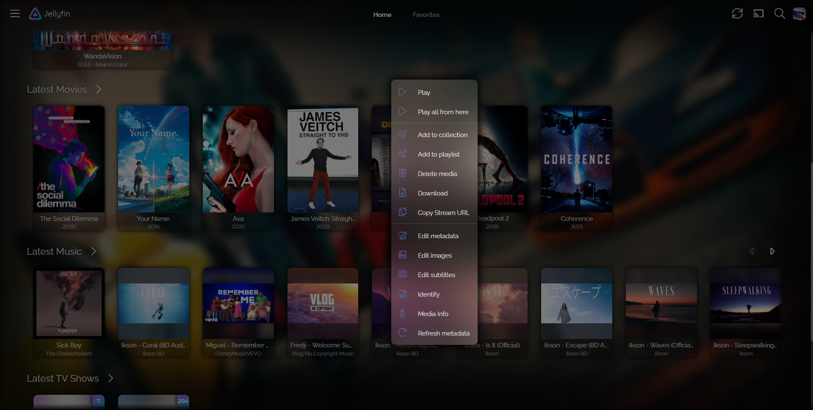
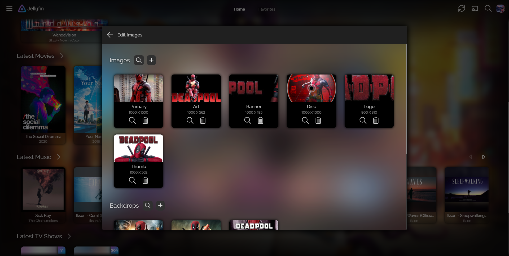
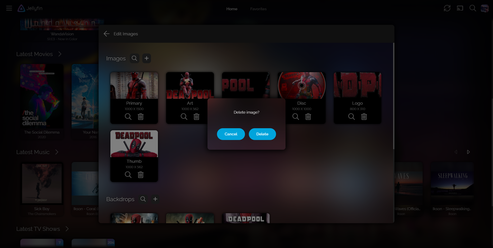

This fork is just a simple modification so it can be used locally in its entirety. There is no resource downloaded form the Internet, everything is included here, all the import calls have been replaced with local ones. The old theme hasn't been touched.  
The Jellyfin Icons repo is included here and has also been modified.

You need three directories from Font Awesome Pro v5.15.3+ not included in this repo because of... legalities:
- metadata
- svgs
- webfonts

These 3 directories should be copied to:

`\Jellyfin-Icons\Font Awesome\`

To use this locally you should download the repo and extract it to a `JellySkin` folder inside the `jellyfin-web` directory, that way you can import it using the lines below.  
Unfortunately I haven't been able to make it work with Jellyfin Media Player unless the theme files are copied to the `jellyfin-web` of JMP.

<div align="center">

## Original readme with some modifications:
### 
<h1>JellySkin</h1><br>

<br>
<h3>Use 67% or 70% zoom in web browser for better experience</h3>
<h4>Note: To take full experience of this CSS on FireFox scroll down below to find the necessary settings.</h4>
</div>
<br>
<h3>How to use</h3>
To use the JellySkin theme copy the line below into "Dashboard -> General -> Custom CSS" and click save, it will apply immediately server-wide to all users on top of any theme they may be using. To remove the theme, clear the "Custom CSS" field and then click save.

  
```css
  @import url("JellySkin/default.css");
```

To use Logos like the images given below use:

```css
  @import url("JellySkin/addons/Logo.css");
```

<h3>Fix Performance</h3>
In JellySkin 11 it has been added a transparency gradient like CTalvio's Themes and just like his skin it has a performance issue on some devices, because of this it has been created a fix that remove all the transparency gradient in the skin.

```css
@import url("JellySkin/addons/imp-per.css");
```
<br>
<h3>If you want to display your posters to be compact use the following line with default css</h3>

```css
@import url("JellySkin/addons/compact-poster.css");
```

To use different gradient for your buttons I have added few different gradients you can choose or you can create your own (check the steps given bellow), the default gradient used is jellyfin's default logo gradient,using this alone will only skin the button colors and I know the names for this are very funny:

```css
@import url("JellySkin/addons/Gradients/seaGradient.css");
@import url("JellySkin/addons/Gradients/sunsetGradient.css");
@import url("JellySkin/addons/Gradients/mauveGradient.css");
@import url("JellySkin/addons/Gradients/nightSkyGradient.css");
```
<br>
Using custom own Gradient or color
Create your gradient or solid color and past it in <code>--accent</code> and gradient in opposite angle in <code>--accent-selected</code> :

  
```css
:root {
  --accent: your gradient;
  --accent-selected: your gradient in opposite angle;
}
```
  
Now, to use your own Gradient (to get great button or any gradient go to https://cssgradient.io/gradient-backgrounds or https://cssgradient.io) or solid color:
  
```css
:root {
  --accent: your gradient;
  --accent-selected: your gradient in opposite angle;
}
```
  
<br>
<h3>Don't like the progress bar</h3>
Add the follwing line to custom CSS with the default css file-

```css
@import url("JellySkin/addons/progress-bar.css");
```

<h3>Here are some images:</h3>

<h5>Login Page</h5>


<h5>Home screen:</h5>


<h5>Library View</h5>




<h5>Title screen:</h5>


<h5>TV Shows Season Episode list:</h5>


<h5>Settings</h5>


<h5>Dashboard</h5>


<h5>Plugins</h5>



<h5>Dialogs</h5>




<br>
<br>

<div class="firefox">
<h3>Enabling backdrop-filter in FireFox</h3>

<code style="display: block !important;">
Deaktiviert From version 70: this feature is behind the
layout.css.backdrop-filter.enabled
preference (needs to be set to
  true
  ) and the
  gfx.webrender.all
  preference (needs to be set to
    true
    ).
 To change preferences in Firefox, visit about:config.
</code>

</div>

<div class="faq">
  <div class="logopull">
    <h2> How to get Logo </h2>
    <ul>
      <li>Get Fanart Plugin, Dashboard -> Plugin -> Catalog</li>
      <li>Enable Fanart as a metadata provider for your libraries in the library settings, Dashboard -> Library -> Click on 3 dots on your Library -> Manage Library -> Scroll to find Metadata provider and enable Fanart in all of them.</li>
      <li>Rescan your drive by selecting <code>Replace Metadata</code> and scan</li>
      <li>Done!</li>
    </ul>
  </div>
  <br>
<h3>Background not working?</h3>
Many of you are facing issues that backdrop is not visible by default....this is not a JellySkin issue but rather Jellyfin issue, in Jellyfin Version 10.7.X backgrounds are disabled by defualt but you can enable them individually on you devices/client by going to:

SETTINGS --> DISPLAY --> ENABLE BACKDROPS/BACKGROUND.
</div>

<div class="conribute" style="text-align: center;">
<h2> Wanna Contribute? </h2>
<ul>
<li>Fork this Repo</li>
<li>Add your features</li>
<li>Create a Pull Request</li>
<li>Wait for it to be merged.</li>
</ul>
</div>
